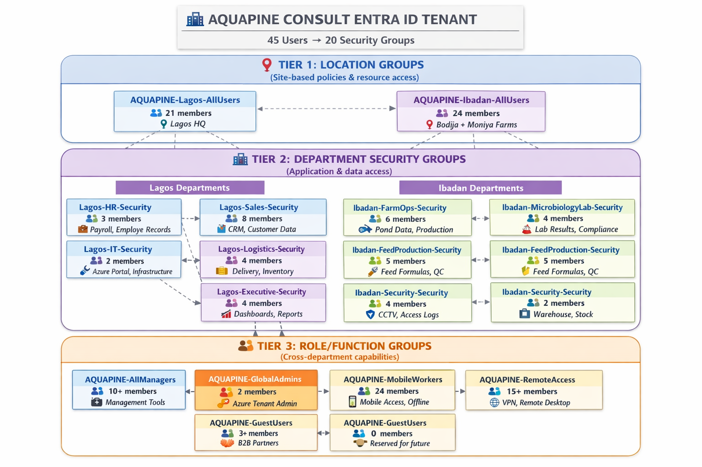

# AQUAPINE CONSULT - Group Hierarchy Architecture

> **Visual representation of the 3-tier security group structure for identity and access management**

---

---

## 📊 Group Membership Matrix

### **Tier 1: Location Groups**

| Group Name | Members | Primary Purpose | Use Cases |
|------------|---------|-----------------|-----------|
| **AQUAPINE-Lagos-AllUsers** | 21 | Location-based policies | • WiFi access<br/>• Conditional Access (IP restrictions)<br/>• Office 365 licensing<br/>• Local printer access |
| **AQUAPINE-Ibadan-AllUsers** | 24 | Farm site policies | • Mobile device management<br/>• Offline sync permissions<br/>• Field worker policies<br/>• Farm-specific apps |

---

### **Tier 2: Department Security Groups (Lagos)**

| Group Name | Members | Department | Access Granted |
|------------|---------|------------|----------------|
| **Lagos-HR-Security** | 3 | Human Resources | • HR Information System<br/>• Payroll application<br/>• Employee records (Azure Files)<br/>• Recruitment tools |
| **Lagos-IT-Security** | 2 | IT Department | • Azure Portal<br/>• Entra ID admin center<br/>• Infrastructure tools<br/>• Monitoring dashboards |
| **Lagos-Sales-Security** | 8 | Sales & Marketing | • CRM (Dynamics 365)<br/>• Customer database<br/>• Sales analytics (Power BI)<br/>• Marketing automation |
| **Lagos-Logistics-Security** | 4 | Logistics | • Delivery management system<br/>• Warehouse inventory<br/>• Supplier portal<br/>• Route optimization tools |
| **Lagos-Executive-Security** | 4 | Executive Management | • Financial dashboards<br/>• Company-wide reports<br/>• Strategic planning tools<br/>• Board presentation files |

---

### **Tier 2: Department Security Groups (Ibadan)**

| Group Name | Members | Department | Access Granted |
|------------|---------|------------|----------------|
| **Ibadan-FarmOps-Security** | 6 | Farm Operations | • Pond monitoring IoT<br/>• Water quality dashboard<br/>• Feeding schedule app<br/>• Production logs |
| **Ibadan-MicrobiologyLab-Security** | 4 | Microbiology Lab | • Lab management system<br/>• Fish health records<br/>• Test results database<br/>• Regulatory compliance docs |
| **Ibadan-FeedProduction-Security** | 5 | Feed Production | • Feed formula database<br/>• Quality control system<br/>• Production scheduling<br/>• Ingredient inventory |
| **Ibadan-Hatchery-Security** | 3 | Hatchery Unit | • Breeding records system<br/>• Larval management<br/>• Genetics tracking<br/>• Hatchery operations app |
| **Ibadan-Security-Security** | 4 | Farm Security | • CCTV access<br/>• Access log system<br/>• Incident reporting<br/>• Gate control system |
| **Ibadan-Store-Security** | 2 | Store/Inventory | • Warehouse management<br/>• Stock tracking<br/>• Supply ordering<br/>• Equipment logs |

---

### **Tier 3: Role/Function Groups**

| Group Name | Members | Membership Criteria | Access Granted |
|------------|---------|---------------------|----------------|
| **AQUAPINE-AllManagers** | 10+ | Job title contains: Manager, Supervisor, Director, Officer | • Management reporting tools<br/>• Budget dashboards<br/>• Team analytics<br/>• Delegation workflows |
| **AQUAPINE-GlobalAdmins** | 2 | CEO + IT Manager only | • Azure Portal (full access)<br/>• Entra ID administration<br/>• Subscription management<br/>• Security & Compliance center |
| **AQUAPINE-MobileWorkers** | 24 | All Ibadan farm staff | • Mobile device enrollment<br/>• Offline app sync<br/>• Mobile-optimized portals<br/>• SMS/push notifications |
| **AQUAPINE-RemoteAccess** | 15+ | IT, Executives, HR, Sales | • VPN authorization<br/>• Remote desktop gateway<br/>• Home office access<br/>• Multi-factor auth |
| **AQUAPINE-FinanceAccess** | 3+ | CFO, Payroll Admin, Executives | • Accounting system<br/>• Financial reports<br/>• Budget planning tools<br/>• Payment authorization |
| **AQUAPINE-GuestUsers** | 0 | External partners (future) | • Limited SharePoint access<br/>• Guest collaboration<br/>• Partner portals<br/>• Time-limited access |

---

## 🎯 User Journey Examples

### **Example 1: Olatunde Ogunti (IT Manager)**

**Profile**:
- Location: Lagos HQ
- Department: IT Department
- Role: Manager + Global Admin

**Group Memberships** (5 groups):
```
📍 AQUAPINE-Lagos-AllUsers
   └─ Gets: Lagos WiFi, office printers, local resources

🏢 Lagos-IT-Security
   └─ Gets: Azure Portal, admin tools, infrastructure access

👔 AQUAPINE-AllManagers
   └─ Gets: Management reports, budget dashboards

🔑 AQUAPINE-GlobalAdmins
   └─ Gets: Full Azure tenant administration

🌐 AQUAPINE-RemoteAccess
   └─ Gets: VPN, work from home access
```

**Why Multiple Groups?**
- Each group grants different permissions
- Separation of concerns (location ≠ role ≠ department)
- Flexible: Can remove from AllManagers without affecting IT access

---

### **Example 2: Adebayo Oladipo (Farm Manager)**

**Profile**:
- Location: Bodija Farm (Ibadan)
- Department: Farm Operations
- Role: Manager + Mobile Worker

**Group Memberships** (4 groups):
```
📍 AQUAPINE-Ibadan-AllUsers
   └─ Gets: Farm site policies, mobile device management

🏢 Ibadan-FarmOps-Security
   └─ Gets: Pond data, water quality systems, production tools

👔 AQUAPINE-AllManagers
   └─ Gets: Management reporting, team analytics

📱 AQUAPINE-MobileWorkers
   └─ Gets: Mobile app access, offline sync
```

---

### **Example 3: Blessing Okoro (Payroll Administrator)**

**Profile**:
- Location: Lagos HQ
- Department: Human Resources
- Role: Finance access (sensitive)

**Group Memberships** (3 groups):
```
📍 AQUAPINE-Lagos-AllUsers
   └─ Gets: Lagos office resources

🏢 Lagos-HR-Security
   └─ Gets: HR systems, employee records

💰 AQUAPINE-FinanceAccess
   └─ Gets: Payroll system, accounting access
```

---

## 🔄 Group Membership Workflow

### **Adding a New Employee**

**Scenario**: New Sales Representative joins Lagos office

**Steps**:
1. **Create user account** (via PowerShell or Portal)
   ```powershell
   New-MgUser -DisplayName "New Employee" -Department "Sales Department" -OfficeLocation "Lagos HQ"
   ```

2. **Automatic group assignment** (if using script):
   - ✅ AQUAPINE-Lagos-AllUsers (location = Lagos HQ)
   - ✅ Lagos-Sales-Security (department = Sales Department)

3. **Manual additions** (role-based):
   - If future manager → Add to AQUAPINE-AllManagers
   - If remote worker → Add to AQUAPINE-RemoteAccess

4. **Access automatically granted**:
   - WiFi at Lagos office
   - CRM system
   - Customer database
   - Sales analytics

**Time**: ~5 minutes (vs. 2+ hours manual configuration)

---

### **Employee Role Change**

**Scenario**: Farm Supervisor promoted to Farm Manager

**Steps**:
1. **Update job title** in Entra ID
   ```powershell
   Update-MgUser -UserId $userId -JobTitle "Farm Manager"
   ```

2. **Add to management group**:
   ```powershell
   New-MgGroupMember -GroupId $managersGroupId -DirectoryObjectId $userId
   ```

3. **No other changes needed**:
   - Still in same location group (Ibadan)
   - Still in same department group (FarmOps-Security)
   - Now gets management reports automatically

---

### **Employee Offboarding**

**Scenario**: Employee leaves company

**Steps**:
1. **Disable account** (immediate access revocation)
   ```powershell
   Update-MgUser -UserId $userId -AccountEnabled:$false
   ```

2. **Effect**: Instantly loses access to:
   - All applications (SSO)
   - Azure resources (RBAC)
   - VPN and remote access
   - Email and Office 365

3. **30 days later**: Delete account
   ```powershell
   Remove-MgUser -UserId $userId
   ```

**No group cleanup needed** - disabling account is sufficient!

---

## 🏗️ Architecture Principles

### **1. Least Privilege**
- Users get minimum access needed for their job
- Global Admin limited to 2 users
- Department groups don't cross-pollinate

### **2. Separation of Duties**
- Finance access separate from HR access
- Admin access separate from daily operations
- Auditing separate from administrative functions

### **3. Defense in Depth**
- Multiple group memberships = multiple checkpoints
- Location + Department + Role = layered security
- Even if one group is compromised, others provide protection

### **4. Scalability**
- Easy to add new departments (create group + assign members)
- Easy to add new locations (create group + update policies)
- Easy to add new roles (create group + define permissions)

### **5. Auditability**
- All group changes logged in Entra ID audit logs
- Who added whom to which group = complete trail
- Compliance reports easy to generate

---

## 📈 Growth Scenarios

### **Scenario 1: New Farm Location (Port Harcourt)**

**Changes needed**:
1. Create new location group: `AQUAPINE-PortHarcourt-AllUsers`
2. Create department groups: `PortHarcourt-FarmOps-Security`, etc.
3. No changes to Tier 3 (role groups work across all locations)

**Effort**: 2 hours

---

### **Scenario 2: New Department (Quality Assurance)**

**Changes needed**:
1. Decide location (Lagos or Ibadan)
2. Create group: `Lagos-QA-Security` or `Ibadan-QA-Security`
3. Update CSV and re-run group assignment script

**Effort**: 30 minutes

---

### **Scenario 3: Acquisition (Merge another company)**

**Changes needed**:
1. Import users from acquired company
2. Map their departments to AQUAPINE groups
3. Create temporary groups for transition period
4. Gradually migrate to standard structure

**Effort**: 1-2 weeks (depending on complexity)

---

## 🔍 Compliance & Audit

### **Regulatory Requirements Met**

✅ **Access Control**: Clear segregation of duties  
✅ **Audit Trail**: All group changes logged  
✅ **Data Residency**: UsageLocation = Nigeria enforced  
✅ **Least Privilege**: Role-based access implemented  
✅ **Review Capability**: Can generate access reports on demand  

### **Audit Reports Available**

**Who has access to HR data?**
```powershell
Get-MgGroupMember -GroupId $hrGroupId | Format-Table DisplayName, UserPrincipalName
```

**What groups is a user in?**
```powershell
Get-MgUserMemberOf -UserId $userId | Select-Object DisplayName
```

**All Global Admins?**
```powershell
Get-MgGroupMember -GroupId $globalAdminGroupId
```

---

## 🎨 Naming Convention Reference

### **Pattern Breakdown**

```
AQUAPINE-Lagos-AllUsers
└─┬─┘   └─┬─┘  └─┬──┘
  │       │      └─ Descriptor (what the group represents)
  │       └─ Location/Department/Role
  └─ Company prefix (global groups)

Lagos-IT-Security
└─┬┘ └┬┘└──┬───┘
  │   │    └─ Type (Security group)
  │   └─ Department
  └─ Location prefix (department groups)
```

### **Prefix Rules**

| Prefix | Scope | Examples |
|--------|-------|----------|
| **AQUAPINE-** | Company-wide groups | AQUAPINE-AllManagers, AQUAPINE-GlobalAdmins |
| **Lagos-** | Lagos HQ departments | Lagos-IT-Security, Lagos-Sales-Security |
| **Ibadan-** | Ibadan farm departments | Ibadan-FarmOps-Security, Ibadan-Hatchery-Security |

### **Suffix Rules**

| Suffix | Meaning | Use Case |
|--------|---------|----------|
| **-AllUsers** | Everyone in location | Location-based policies |
| **-Security** | Security group | RBAC and app access |
| **-Access** | Permission-focused | Specific capability (FinanceAccess) |
| **(no suffix)** | Role or function | AQUAPINE-AllManagers |

---

## 📚 Related Documentation

- [Main README](../README.md) - Complete project overview
- [Deployment Guide](../README.md#deployment-guide) - Step-by-step deployment
- [RBAC Matrix](./rbac-matrix.md) - Azure role assignments (coming soon)
- [User CSV Template](../aquapine-users.csv) - Employee master list

---

## 📝 Change Log

| Date | Change | Reason | Impact |
|------|--------|--------|--------|
| 2026-01-19 | Initial 3-tier structure | Foundation deployment | 20 groups created |
| TBD | Add dynamic groups | If P1 licensing acquired | Auto-membership |
| TBD | Add guest collaboration | Partner onboarding | AQUAPINE-GuestUsers activation |

---

**Last Updated**: January 19, 2026  
**Author**: Olatunde Ogunti (IT Manager, AQUAPINE CONSULT)  
**Version**: 1.0  

---

*This diagram is part of the AQUAPINE Azure Infrastructure portfolio demonstrating production-ready identity architecture for AZ-104 certification.*